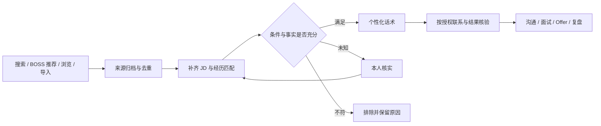

# 职途 Atlas

中文 · [English](README.en.md)

**用自己的经历找到值得争取的岗位，把分析、联系和跟进做成一条可核对的流程。**

职途 Atlas 是面向个人的本机求职工作台。它将岗位、简历证据、招聘对话、面试和 Offer 关联起来，帮助你回答三个问题：**这个岗位适不适合我？怎样说明我能做什么？联系之后该推进什么？**

当前版本 **0.22.1** · 桌面与本机网页共用数据 · 已验证 Linux x64 · 中文界面、日间模式。

[快速开始](docs/QUICK_START.md) · [使用指南](docs/USER_GUIDE.md) · [版本与验证](docs/DISTRIBUTION_0221.md) · [参与开发](CONTRIBUTING.md)

## 核心差异

| 关注点 | Atlas 的实现 |
| --- | --- |
| 匹配有依据 | 将 JD 要求与本人确认的经历逐项对应，区分满足、缺口和未知；保留证据来源，不把关键词分数当作录用概率 |
| 联系有针对性 | 根据当前 JD、相关经历及会话生成话术；核对事实，相关时引用本人确认贡献的公开项目，不给所有岗位发送同一段介绍 |
| 执行可核验 | 生成草稿、建立会话、发出匹配说明、投递附件分别记录；发送不确定时交由本人核实，避免自动重发 |
| 进展能接续 | 岗位、公司、招聘者、会话和面试关联；发现页、沟通中心、地图与统计读取同一批业务记录 |
| Agent 工作看得见 | 任务中心展示主 Agent 安排、子任务、当前步骤、草稿和结果；可查看、修改和启停相关提示词 |
| 数据与模型由自己掌握 | 业务数据和凭据存放本机，可配置自己的兼容模型服务；桌面和网页共用后台，模型不直接取得发送权限 |

这些是实现侧的设计取舍，**不代表比其他工具更高的面试率或录用率**。真正的价值要通过岗位相关性、沟通质量、节省的时间和实际推进结果验证。

## 从找岗位到跟进



- **机会发现**：汇总主动搜索、BOSS 推荐、正常浏览及 CSV／JSON 导入；保留来源并去重，统一使用本人设置的方向、城市、薪资和排除条件。
- **沟通中心**：查看会话、JD、匹配依据和拟回复；企业研究可结合公开资料与新消息更新判断。
- **企业与进展**：按公司、岗位和联系人管理阶段、待办、面试与 Offer；总览展示同口径统计和地区分布。
- **全局分析与任务中心**：查看简历准备、市场样本、可优化项和 Agent 执行过程。未知信息保留为未知，不补造结论。

## 关于作者与求职方向

我是 **董正法**，拥有 **10 年以上产品经验**，覆盖 C 端应用、企业 SaaS 和智能硬件，具备产品增长、跨职能团队管理及企业 AI 应用落地经验。现寻找 **上海地区的产品负责人、资深专家或 AI 产品相关岗位**。

这个项目展示了我将求职流程拆解为产品能力，并组织 AI 分析、交互设计、工程实现与验证的实践。欢迎用人团队结合代码与实际需求交流。

**微信：164245026** · [GitHub](https://github.com/xydzf520) · [SkillForge 企业 AI 项目](https://github.com/xydzf520/skillforge)

以上是作者主动公开的职业介绍与联系渠道，**不是软件内置的候选人资料或默认求职策略**。

## 开始使用

**已打包客户端**：可在 [Releases](https://github.com/xydzf520/zhitu-atlas/releases) 查看已发布版本；完整 Linux 包解压后运行 `./start.sh`，需要应用菜单入口时执行 `./install.sh`。包内自带运行时，不需要 Node.js。尚无可下载版本时使用下方源码方式；CI 也会提供短期构建产物。

**从源码启动**：需要 Node.js 22.13+、pnpm 8.15.9 和 Linux 图形桌面。依赖安装会下载 Electron。

```bash
git clone https://github.com/xydzf520/zhitu-atlas.git
cd zhitu-atlas
pnpm install --frozen-lockfile
pnpm build
pnpm start
```

首次使用按四步进行：

1. 在「简历与资料」录入自己的经历，核实可用于话术的事实。
2. 在「机会发现」填写目标岗位、城市、薪资和排除条件；可先手动添加岗位，或导入[空白 CSV](examples/jobs-template.csv)／[虚构 JSON 示例](examples/jobs-fictional.json)。
3. 按需在「设置」配置自己的模型和天地图 Key；BOSS 连接需在桌面工作台登录自己的账号。
4. 先查看匹配依据和拟发送内容，再选择逐条确认或匹配后自动联系，检查限额、时段和暂停状态。

**新安装资料为空，自动任务与发送默认暂停。** 手动资料、机会、阶段与导入功能无需外部账号。模型、地图和 BOSS 都不附送共享凭据。

桌面启动后，本机网页为 `http://127.0.0.1:5178/desktop.html`。构建后也可用 `pnpm web` 独立运行资料与历史管理；BOSS 自动读取与发送需要桌面。其他浏览器的 BOSS 登录态不会自动共享。[完整首次使用指南](docs/QUICK_START.md)。

## 当前范围

| 能力 | 范围与限制 |
| --- | --- |
| 自动联系 | 开聊并发送匹配说明；附件简历、正式申请、薪资承诺和面试确认仍需本人确认。不是无条件海投 |
| 平台连接 | 当前有 BOSS 桌面适配及文件导入；平台页面、风控和账号状态会影响可用性，登录不代表全历史同步。猎聘实时接入尚未实现 |
| 模型 | 支持自定义 Chat Completions 兼容接口、CommandCode、DeepSeek 或兼容本机服务；先测试生成和工具调用，具体能力由所选服务决定 |
| 地图 | 全国／城市切换使用本人的天地图 Key；无 Key 或断网时保留地区筛选与地址列表。区域汇总不代表企业精确坐标 |
| 系统 | 完整客户端已在 Ubuntu 26.04 x64 验证；其他 Linux 发行版待验证，Windows／macOS 尚无正式包 |
| 验证 | 0.22.1 基线通过 503 项测试、类型检查、生产构建、隔离安装及桌面／网页流程检查；真实地图服务和真实 BOSS 发送需要按账号另行验收 |

## 本机存储与隐私

业务数据默认在 `~/.local/share/zhitu-atlas/`，桌面登录会话在 `~/.local/share/zhitu-atlas-desktop/`。本机 HTTP 仅监听回环地址，使用来源检查与会话凭据。

模型与地图 Key 保存到本机私有配置，不写进代码、前端或安装包，不随业务迁移备份导出。**本机保存不等于全程离线：AI 会把任务所需的经历、JD 或对话发送到本人选择的服务；企业搜索和在线地图也会产生外部请求。**

公开仓库不包含作者的完整简历、求职数据库、聊天、Cookie、服务密钥或旧私有 Git 历史。测试使用虚构资料，公开的作者联系方式仅用于求职交流。[隐私说明](docs/PRIVACY.md) · [本机配置](docs/LOCAL_CONFIGURATION.md) · [发布检查](docs/PUBLICATION_0221.md)。

## 开发与许可

`pnpm check` 执行隔离测试、Node／Vue 类型检查和生产构建；`pnpm check:public:history` 检查源码及可达历史中的疑似凭据。完整 Linux 包可用 `node scripts/atlas-package.cjs artifacts/releases/atlas-linux` 构建。

Atlas 可授权的自有内容采用 [ISC](LICENSE)。保留[第三方声明](THIRD_PARTY_NOTICES.md)、[代码来源](docs/PROVENANCE.md)和[地图服务说明](docs/MAP_DATA_SOURCES.md)；公开快照不会抹去历史来源或第三方权利。尚未完成独立安全审计。

[架构](docs/ARCHITECTURE.md) · [运行、升级与回滚](docs/OPERATIONS.md) · [安全报告](SECURITY.md) · [全部文档](docs/README.md)
