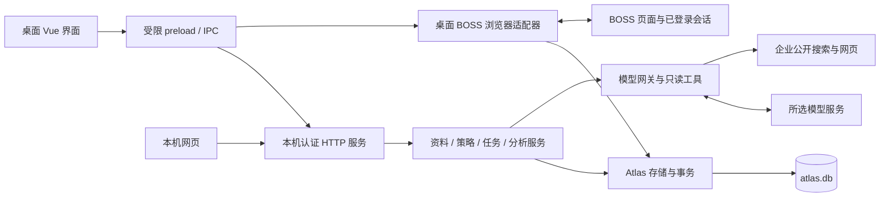

# 架构与数据流

按 **0.21.2** 代码核对。本说明描述当前运行组成，各节注明功能引入版本。

## 运行组成

文字说明：桌面界面通过 preload 发起允许的调用，主进程转到本机 HTTP 服务；网页直接调用同一服务。后台执行通用业务和持久化 AI 任务。**BOSS 浏览器及采集、联系、回复工作器运行在桌面主进程**，也通过 Atlas 存储模块访问同一 SQLite 库，以事务、账号租约和检查点协调。当前不是“所有业务写入都必须先经过 HTTP”的单进程架构。

桌面使用 Electron utility process 管理后台；也可通过 `pnpm web` 启动 Node 后台。桌面会检查并复用已有同目录服务。已有独立网页进程的退出需由启动它的终端负责；不能把所有后台都当作桌面子进程。

服务固定监听 `127.0.0.1:5178`。`ATLAS_DATA_ROOT` 隔离资料，但不自动分配端口，因此完整客户端测试不能和生产后台同时占用此端口。正式网页来自 `web-dist`；Vite 5179 仅提供开发资源，没有独立业务写入接口。

## 存储与版本

| 数据 | 位置与约束 |
| --- | --- |
| 资料版本、策略、岗位、会话、消息、任务和分析历史 | `atlas.db`，显式 schema 迁移、WAL、事务和业务版本检查 |
| 模型凭据 | `private/models.json`，目录 0700、文件 0600，设置接口不返回已保存密钥 |
| 本机连接信息 | `storage/atlas-runtime.json`，权限 0600，后台启动生成随机 token |
| 简历附件 | 数据根下 `attachments` 或恢复创建的附件目录；与正文版本分开保存 |
| BOSS 登录会话 | Electron 独立 userData 目录中的持久化 session |
| 编辑中的文字 | 视功能保存在组件或浏览器 sessionStorage；不等于所有草稿都已跨设备持久化 |
| 旧数据库与配置 | 迁移时只读导入；可靠账号 ID 可归属，未知归属进入档案 |

界面提交资料、策略和关键草稿时携带版本，冲突时保留草稿并要求合并。`atlas.db` 是业务主库；模型配置、附件和运行元信息并非都塞进这一个数据库。旧 `public.db` 不再有独立执行器持续写入。

岗位和消息以平台、账号、来源 ID 定位；企业名称相似只用于提示，不作可靠主键。发现状态和求职阶段不同，收藏、加入跟进或拖动看板不代表已经联系。

## 存储读写优化（0.18.2）

- `analysis_contents` 保存不可变的分析正文，按正文 SHA-256 去重；父级缓存、发现记录和任务仍保留各自的账号、资料版本、模型与证据元信息。内容相同不代表跨账号合并业务记录。
- schema 6 迁移原有内嵌正文，失败整体回滚。所有业务入口读取时还原原结构，因此界面和后续事实校验不依赖内部引用格式。
- 岗位、会话分页使用进程内派生模型与 SQLite 临时索引表。首次读取或源数据变化时仍全量计算匹配与排序，此后筛选、计数、翻页走 SQL；这是缓存优化，并非完全无内存的数据库排序。源表触发器更新版本，跨进程写入也会使缓存失效。
- 原始采集岗位读取不再截断到 5,000 条；跟进清单仍保留既有 5,000 项上限，两者不同。
- V2 备份以一致性 SQLite 快照和附件为基础，1 MiB 分块压缩加密、分块上传下载；数据库恢复使用同一事务，附件先进入新版本目录，数据库提交后切换引用。临时备份不包含登录 Cookie、API 密钥或执行租约。

文件格式、限制、性能和回滚见 [存储升级与验证](STORAGE_UPGRADE_20260921.md)。

## 执行链与恢复

1. 采集正常 BOSS 页面或已加载响应；校验账号，再归档岗位、来源和观察时间。
2. 搜索／推荐共用每日预算，补 JD 后做匹配；缺少必要事实时停在待核实。
3. 后台 AI 任务记录用途、输入版本、心跳、预算和结果；切页面不重新生成同一个在途任务。
4. 个性化话术经过事实核对，联系工作器检查授权、账号、去重、时段、额度、草稿和最新消息。
5. 平台操作后回读实际消息；正确文本和消息凭据才支持成功。默认招呼与定制说明分步记录。
6. 状态保存在 SQLite。重启后未执行步骤可继续，但发送结果不确定、模型结果可能已计费等情况不静默重试。

AI 任务在创建时记录资料版本、策略相关字段、模型配置和全部 Agent 提示词指纹；同一依据的在途请求复用任务，派发前变化则中断并保留记录。手动队列优先于尚未执行的自动队列，运行中的请求不抢占。当前仍使用单一模型执行租约，并非并行推理池；长调用会影响后续等待时间。

同步与平台自动动作共享账号协调机制，人工输入优先。模型等待期间释放相应浏览器占用。全局暂停通过持久化策略约束新自动步骤；后台已有请求仍需结束、取消或超时后记录状态。

0.18 完整客户端检查验证了后台崩溃恢复和双开限制；这不等于所有平台异常都能自动恢复。平台登录失效、验证页、页面结构变化会暂停相关动作，保留错误与待处理记录。

## 模型、搜索与外部数据

| 外部目标 | 哪些数据会发送 | 用途 |
| --- | --- | --- |
| 所选模型渠道 | 当前任务需要的 JD、候选人资料／已确认经历、相关已同步消息、提示词及工具结果 | 匹配、话术、回复、面试准备和研判 |
| 企业公开搜索 | 程序组合的企业名称与固定业务主题 | 查找公开来源；不把简历或完整聊天原文作为搜索词 |
| 搜索返回的公开网页 | 所选来源 URL 与正常 HTTPS 请求 | 读取可公开访问的文本 |
| GitHub 公开元数据 | 资料中提供的公开仓库标识 | 核实公开状态、非空仓库及许可证 |
| OSM 瓦片服务 | 当前地图视野涉及的瓦片请求 | 在线底图，保留署名，不批量预下载 |
| BOSS | 已登录会话及本人授权的平台操作 | 岗位、消息读取及联系 |

企业检索直接使用公开 HTML 搜索页，没有额外的搜索 API 密钥；现有实现使用 Bing。公开搜索不保证可读、完整或主体唯一。网页内容作为资料，不能成为修改规则、确认经历或发送消息的指令。

模型使用受限工具集合，不获得通用浏览器控制、Shell 或任意文件读取能力。企业研判工具只能读取本轮受校验的公开来源；常规经历工具只查本次输入中已确认的证据 ID。工具是否成功及实际调用模型以记录为准，详见 [模型说明](COMMANDCODE.md)。

## 代码定位

| 部分 | 主要入口 |
| --- | --- |
| 桌面生命周期 | [main/index.ts](../packages/ui/src/main/index.ts) |
| 后台启动、HTTP 与统一处理器 | [service.ts](../packages/ui/src/main/service.ts)、[atlas-server.ts](../packages/ui/src/main/features/atlas-server.ts)、[atlas-service.ts](../packages/ui/src/main/features/atlas-service.ts) |
| 受限桥接 | [preload/index.ts](../packages/ui/src/preload/index.ts)、[desktop-bridge.ts](../packages/ui/src/common/desktop-bridge.ts) |
| 安装迁移与存储 | [atlas-installation.ts](../packages/ui/src/main/features/atlas-installation.ts)、[atlas-store.ts](../packages/ui/src/main/features/atlas-store.ts)、[atlas-migrations.ts](../packages/ui/src/main/features/atlas-migrations.ts) |
| AI 任务与平台浏览器 | [atlas-task-queue.ts](../packages/ui/src/main/features/atlas-task-queue.ts)、[atlas-boss-browser.ts](../packages/ui/src/main/features/atlas-boss-browser.ts) |
| 模型和企业搜索 | [atlas-model-transport.ts](../packages/ui/src/main/features/atlas-model-transport.ts)、[atlas-company-research.ts](../packages/ui/src/main/features/atlas-company-research.ts) |

## 当前边界

本版本是本机应用，没有公网账户服务、多设备实时同步或云端常驻调度。猎聘实时适配、真实公交路线计算、Windows／macOS 完整发行验收尚未交付。

安全控制已包括回环监听、来源和 token 校验、受限 IPC、CSP、私有数据权限及迁移校验；本机接口没有细粒度用户角色授权或全局速率限制。旧安全评审的关闭范围和残留项见[状态对照](../SECURITY-REVIEW-web-service.md)，不能据一次重构宣称所有安全问题均已解决。

## 全局分析与地区适配（0.19）

`atlas-insights` 从统一资料、当前账号 `platform_jobs` 与手动机会汇总快照，按来源 ID 去重。统计完整窗口，模型只读取最新 60 份有长度上限的 JD 与简历摘要。缓存绑定账号、资料版本、岗位内容、窗口、模型参数与 Agent 签名；当前岗位分析须同时满足资料、模型、提示词和 JD 版本才进入证据矩阵。

`career-resume-review`、`career-market-review` 进入持久任务队列和统一模型网关。生成前检查依据，生成后事务内重查；引用不存在、优势缺少确认来源、机会缺少岗位来源或响应格式错误均保留旧报告。模型只返回建议，不能改变执行授权。两项 Agent 与已有 Agent 共用版本、启停、取消和用量记录。新报告写入 `documents` 命名空间，不新增数据库结构；继续 schema 6。

`regions.ts` 使用本地平台城市目录统一搜索代码、地址归属和地图统计。页面渲染全国城市/区县分布，Leaflet 只绘制确认的有效 WGS84 坐标，在线瓦片按需加载。来源和使用边界见 `packages/ui/src/common/data/README.md`。

## 求职协调（0.20）

`atlas-coordinator` 构造有限的行动目录，模型仅返回候选 ID、顺序和简短理由。程序保留重要事项、按优先级分组，并在提交前重新检查账号、资料、JD、会话及策略。协调器不获得通用 RPC、浏览器或发送工具。`startContacts` 会写入授权与解除暂停，因而不在可调用目录中；协调器只能在现有授权允许时使用 `enqueueContact`。

安排、行动幂等记录、配置和历史写入 `atlas.db` 的 `atlas-coordinator-*` 文档。任务调度器每分钟协调一次，沿用同一任务队列、模型租约及实际发送核验；一个失败或响应未知的行动不会因刷新安排而自动重试。自动搜索复用发现采集器，模型等待不占浏览器；回复由既有回复模块和沟通中心处理。协调器可安排企业研判与面试准备，重要消息留给本人处理。

独立预算为每日 2 次规划调用、6 项辅助分析，全窗口与账号共用；岗位读取、分析、发送沿用原预算。默认只给建议，恢复备份后也回到建议模式。候选最多扫描当前账号最新 120 个岗位与 30 个会话，输入和页面明确样本范围；不把联系结果解释为录用概率或因果收益。schema 仍为 6，无破坏性迁移。
